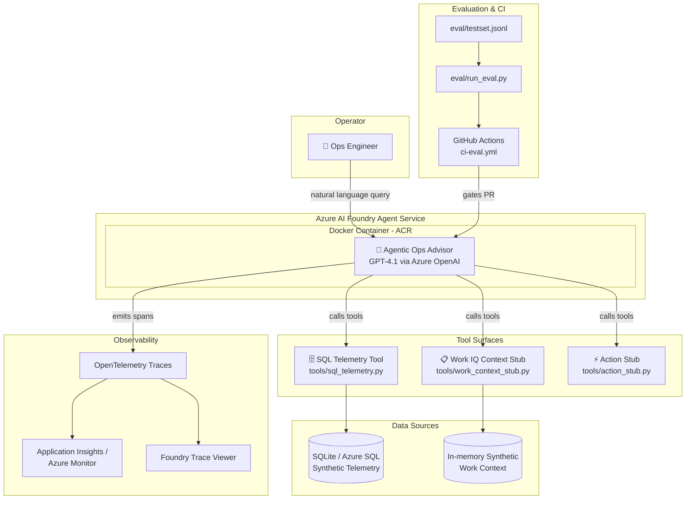

# Agentic Ops Advisor

> ⚠️ **Synthetic Data Only** — This demo uses entirely synthetic data. No real infrastructure, customer, or Microsoft internal data is included. (See [Disclaimers](#11-disclaimers))

> ℹ️ **Work IQ Notice** — We're simulating Work IQ outputs in this demo. Work IQ is in public preview and requires Microsoft 365 Copilot licensing + admin consent for tenant data access. (See [Disclaimers](#11-disclaimers))

A **governed, production-style AI agent** that performs root-cause + change-context reasoning over infrastructure telemetry and operator intent. Built for deployment to **Azure AI Foundry Agent Service**, this demo showcases agentic ops, hybrid governance, and self-driving operations aligned with the Azure AI Foundry platform.

> 🌐 **[Project Brochure Site](https://tammym-demos.github.io/Agentic-Ops-Advisor/)** — Interactive overview site for demos and walkthroughs. Covers architecture, Work IQ integration, evaluation framework, and the full GitHub-to-Azure delivery pipeline.

---

## Table of Contents

- [🎬 Running the Demo](#-running-the-demo)
1. [Project Overview & Architecture](#1-project-overview--architecture)
2. [Prerequisites](#2-prerequisites)
3. [Local Setup](#3-local-setup)
4. [Feature Flags](#4-feature-flags)
5. [Running Evaluations](#5-running-evaluations)
6. [Deploying to Azure](#6-deploying-to-azure)
7. [Container Deployment](#7-container-deployment)
8. [Regression Demo Walkthrough](#8-regression-demo-walkthrough)
9. [Environment Variables Reference](#9-environment-variables-reference)
10. [Monitoring Setup](#10-monitoring-setup)
11. [Disclaimers](#11-disclaimers)
12. [Troubleshooting / FAQ](#12-troubleshooting--faq)

---

## Quick Start

### For Local Development (No Azure)

```bash
# 1. Clone and enter the repo
git clone https://github.com/tammym-demos/Agentic-Ops-Advisor.git
cd Agentic-Ops-Advisor

# 2. Create virtual environment
python -m venv .venv
source .venv/bin/activate        # Linux / macOS
# .venv\Scripts\activate         # Windows (PowerShell)

# 3. Install dependencies
pip install -r requirements.txt

# 4. Seed the local SQLite database (12,966 rows of synthetic telemetry)
python scripts/setup_local_db.py

# 5. Run the advisor (Demo mode — no Azure credentials needed)
python scripts/run_local.py

# 6. Run the test suite (346 tests)
python -m pytest tests/ -q
```

> **Demo mode** runs without Azure OpenAI — queries hit the local tools directly. Set `AZURE_OPENAI_ENDPOINT` in `.env` to enable full **Agent mode** with LLM-powered reasoning.

### For Production Deployment to Azure (azd-based)

**Prerequisites:** Azure CLI, [azd CLI](https://learn.microsoft.com/en-us/azure/developer/azure-developer-cli/install-azd), Python 3.11+

```bash
# 1. Install the Azure AI Agents extension
azd ext install azure.ai.agents

# 2. Log in to Azure
azd auth login

# 3. Deploy infrastructure + agent (one command)
azd up

# 4. Open the Foundry portal
# Navigate to ai.azure.com → your project → Agents → agentic-ops-advisor
```

> **What `azd up` does:** Provisions Azure AI Foundry, Azure OpenAI, Azure SQL, Application Insights, and deploys the agent as a containerized hosted agent. Configuration is declarative in `azure.yaml` and `agent.yaml`. See [Deploying to Azure](#6-deploying-to-azure) for details.

---

## 🎬 Running the Demo

Three ways to run the Agentic Ops Advisor, from simplest to full cloud:

### Option A — Local Demo Mode (No Azure Required)

The fastest way to see the agent's tool surface in action. No LLM, no cloud — queries run directly against the local SQLite database.

Follow the [Quick Start](#quick-start) steps 1–4 above, then clear the Azure endpoint to force demo mode:

```bash
# Clear the Azure endpoint to force demo mode
# (your .env may have AZURE_OPENAI_ENDPOINT set)

# Linux/macOS:
unset AZURE_OPENAI_ENDPOINT

# Windows PowerShell:
$env:AZURE_OPENAI_ENDPOINT = ""

# Run the agent
python scripts/run_local.py
```

> **💡 Tip:** If the agent crashes with `Missing credentials`, your `.env` file has `AZURE_OPENAI_ENDPOINT` set. Clear it as shown above to use demo mode.

### Option B — Local Agent Mode (Azure OpenAI)

Full LLM-powered reasoning with GPT-4.1. The agent correlates telemetry with change context and provides root-cause analysis with confidence scores.

#### B1. Interactive CLI Mode

```bash
# 1. Log in to Azure (for DefaultAzureCredential)
az login --tenant <your-tenant-id>

# 2. Ensure .env has these variables set:
#    AZURE_OPENAI_ENDPOINT=https://hub-agentops-prod.openai.azure.com
#    AZURE_OPENAI_DEPLOYMENT=gpt-4.1

# 3. Run the agent
python scripts/run_local.py
```

#### B2. HTTP Server Mode (matches production)

Runs the hosted agent HTTP server locally — same code path as production deployment.

```bash
# Start the server (includes chat UI at http://localhost:8088)
python scripts/serve.py
```

Then:
- **Open browser:** `http://localhost:8088` — interactive chat UI
- **Or send requests:** `POST http://localhost:8088/responses` — Foundry Responses API

> **💡 Tip:** HTTP server mode is the best way to test the production deployment locally. The chat UI (`static/index.html`) provides the same experience as the Foundry portal.

> For details on how Agent mode works (function-calling, confidence scores, evidence citations), see [Step 6 — Run the agent](#step-6--run-the-agent) in Local Setup.

### Option C — Azure AI Foundry (Cloud Deployment)

The full production deployment — the agent runs as a **hosted agent** container in Azure AI Foundry Agent Service. The container implements the Foundry Responses API and includes a baked-in SQLite database with synthetic telemetry.

1. **Trigger a deploy** — push to `main` or manually dispatch the `deploy.yml` workflow
2. **Open the Foundry portal** — [ai.azure.com](https://ai.azure.com) → your project → **Agents** → **agentic-ops-advisor**
3. **Chat with the agent** — use the built-in chat UI to ask questions
4. **View traces** — see [Monitoring Setup](#10-monitoring-setup) for Foundry and Application Insights trace viewing

> **How it works:** The agent runs as a hosted agent (protocol: `responses` in `agent.yaml`). The Docker build seeds a fresh SQLite database at image build time. The container's HTTP server (`scripts/serve.py`) handles all requests via POST `/responses` on port 8088. Tool dispatch happens server-side inside the container — no client-side coordination needed.

### Demo Query Suggestions

| # | Query | What It Shows |
|---|-------|---------------|
| 1 | "Why did GPU utilization drop in the last 24h?" | Telemetry correlation + anomaly detection |
| 2 | "What changed right before the latency spike?" | Change-context reasoning (Work IQ) |
| 3 | "Is this a known issue or a change-caused incident?" | Incident + change event cross-referencing |
| 4 | "What's the safest remediation plan?" | Risk-aware action proposals |

### Planted Anomalies in the Synthetic Data

> See [Planted Anomalies](#planted-anomalies) in Local Setup for the full table of injected anomalies and their expected agent behavior.

> For the full 7-step regression demo script (inject fault → detect → fix → recover), see [Regression Demo Walkthrough](#8-regression-demo-walkthrough).

---

## 1. Project Overview & Architecture

The **Agentic Ops Advisor** is an AI agent that helps ops engineers diagnose infrastructure issues by combining two signals: **telemetry** (GPU utilization, network latency, cost, incidents) and **operator intent** (change events, decisions, runbooks, ownership). Instead of manually cross-referencing dashboards and change logs, you ask the agent a natural-language question and it does the correlation work for you—citing evidence at every step.

The agent is designed as a **production-readiness showcase**: it integrates OpenTelemetry tracing, offline + continuous evaluation, CI-gated regression detection, and a one-command local setup. It is deployed to **Azure AI Foundry Agent Service as a hosted agent**, implementing the Foundry Responses API for server-side tool dispatch and stateless request handling.

### Architecture Diagram



### Tech Stack

| Layer | Technology |
|---|---|
| Language | Python 3.11+ |
| Agent Framework | Azure AI Agent Service SDK (`azure-ai-projects`) — hosted agent pattern |
| Deployment Pattern | Hosted agent implementing Foundry Responses API (server-side tool dispatch) |
| LLM | GPT-4.1 via Azure OpenAI |
| Local Database | SQLite (dev) / Azure SQL (production) |
| Evaluation | `azure-ai-evaluation` + custom evaluators |
| Observability | OpenTelemetry → Application Insights / Azure Monitor |
| IaC | Bicep templates (`infra/`) |
| CI/CD | GitHub Actions |
| Container | Docker → Azure Container Registry (ACR) |

---

## 2. Prerequisites

Before you begin, ensure you have the following installed and configured:

| Requirement | Version / Notes |
|---|---|
| Python | 3.11 or higher |
| Azure CLI (`az`) | [Install guide](https://learn.microsoft.com/en-us/cli/azure/install-azure-cli) — must be authenticated (`az login`) |
| Azure Developer CLI (`azd`) | [Install guide](https://learn.microsoft.com/en-us/azure/developer/azure-developer-cli/install-azd) — required for `azd up` deployment |
| GitHub CLI (`gh`) | [Install guide](https://cli.github.com/) — for CI/CD operations |
| Git | Any recent version |
| Azure Subscription | With access to create AI Foundry, Azure OpenAI, and Azure SQL resources |
| Docker | [Install guide](https://docs.docker.com/get-docker/) — for container builds and local testing |

**Required Azure resource providers** (register once per subscription):

```bash
az provider register --namespace Microsoft.Sql
az provider register --namespace Microsoft.CognitiveServices
az provider register --namespace Microsoft.MachineLearningServices
az provider register --namespace Microsoft.OperationalInsights
az provider register --namespace Microsoft.KeyVault
az provider register --namespace Microsoft.ContainerRegistry
```

**Required Azure resources** (provisioned automatically via `azd up` — see [Deploying to Azure](#6-deploying-to-azure)):

- Azure AI Foundry project (includes Azure OpenAI)
- Azure SQL Database (production) or SQLite (local dev — no setup needed)
- Application Insights workspace

---

## 3. Local Setup

Follow these steps exactly to get the agent running on your machine.

### Step 1 — Clone the repository

```bash
git clone https://github.com/tammym-demos/Agentic-Ops-Advisor.git
cd Agentic-Ops-Advisor
```

### Step 2 — Create and activate a virtual environment

```bash
python -m venv .venv
source .venv/bin/activate        # Linux / macOS
# .venv\Scripts\activate         # Windows (PowerShell)
```

### Step 3 — Install dependencies

```bash
pip install -r requirements.txt
```

### Step 4 — Configure environment variables

```bash
cp .env.example .env
```

Open `.env` in your editor and fill in the required values. For local dev in **Demo mode** (no LLM), you only need:

```dotenv
DB_MODE=sqlite
ENABLE_WORK_IQ=true
ENABLE_MCP=false
```

To enable **Agent mode** (LLM-powered reasoning), also add:

```dotenv
AZURE_OPENAI_ENDPOINT=https://your-resource.openai.azure.com/
AZURE_OPENAI_DEPLOYMENT=gpt-4.1
AZURE_AI_PROJECT_CONNECTION_STRING=your-project-connection-string
```

> See [Environment Variables Reference](#9-environment-variables-reference) for the full table.

### Step 5 — Seed the local database

This generates 30 days of synthetic telemetry with planted anomalies (12,966 rows total):

```bash
python scripts/setup_local_db.py
```

The script supports optional flags:
- `--db PATH` — custom database path (default: `data/telemetry.db`)
- `--days N` — number of days of synthetic history (default: 30)
- `--force` — delete and recreate the database if it already exists

Expected output:
```
============================================================
  Agentic Ops Advisor — Local DB Setup
============================================================
  Database : data/telemetry.db
  History  : 30 days of synthetic data

  ✓ Data directory ready: data
  ✓ Schema created / verified (4 tables)
  ✓ telemetry_gpu: 8,640 rows inserted
  ✓ telemetry_net: 2,160 rows inserted
  ✓ telemetry_cost: 2,160 rows inserted
  ✓ incidents: 6 rows inserted

  Setup complete ✓

  Run `python scripts/run_local.py` to start the agent.
```

#### Telemetry Schema

| Table | Columns | Description |
|---|---|---|
| `telemetry_gpu` | `ts`, `cluster`, `node`, `utilization_pct`, `mem_pct` | Hourly GPU metrics per cluster/node |
| `telemetry_net` | `ts`, `site`, `latency_ms`, `loss_pct`, `throughput_gbps` | Hourly network metrics per site |
| `telemetry_cost` | `ts`, `cluster`, `cost_usd`, `token_cost_usd` | Hourly cost samples per cluster |
| `incidents` | `ts`, `service`, `symptom`, `severity`, `status` | Infrastructure incident log |

#### Planted Anomalies

| Day | Anomaly | Details |
|---|---|---|
| 18 | GPU utilization drop | `cluster-a` / `node-1` collapses to < 15% |
| 22 | Network latency spike | `site-west` latency exceeds 180 ms, packet loss spikes |
| 25 | Cost surge | `cluster-a` spend jumps 5–7× baseline |

### Step 6 — Run the agent

```bash
python scripts/run_local.py
```

The runner detects your environment and starts in one of two modes:

| Mode | When | Description |
|---|---|---|
| **Agent mode** | `AZURE_OPENAI_ENDPOINT` is set | Full reasoning loop powered by GPT-4.1 with function-calling against the local SQLite database. Requires Azure OpenAI credentials. |
| **Demo mode** | No Azure credentials | Tool-only mode — queries are executed directly against the local database and results are printed as JSON. No LLM required; useful for validating the data layer. |

> See [Demo Query Suggestions](#demo-query-suggestions) for the full list with descriptions.

Type a number (1–4) to run a suggested query, or type your own question. Type `quit` or press `Ctrl+C` to exit.

**Health endpoint:** The runner also starts a health check server on port 8080. You can verify it's running:

```bash
curl http://localhost:8080/health
# Response: {"status": "healthy", "timestamp": "2024-...", "version": "0.1.0"}
```

This endpoint is used by the Docker HEALTHCHECK and doesn't require Azure credentials.

### Step 7 — Run the test suite

```bash
python -m pytest tests/ -q
```

All **346 tests** should pass with 0 failures.

---

## 4. Feature Flags

Feature flags are controlled via environment variables in `.env`. They let you scope the demo to what you want to show.

> These flags are documented in the [Environment Variables Reference](#9-environment-variables-reference). Key flags for demos:

- **`ENABLE_WORK_IQ`** (`true`) — Enable/disable the Work IQ context tool
- **`ENABLE_MCP`** (`false`) — Enable/disable the MCP server wrapper
- **`AZURE_TRACING_GEN_AI_CONTENT_RECORDING_ENABLED`** (`false`) — Record prompt/completion content in traces

---

## 5. Running Evaluations

The evaluation framework measures agent quality across four metrics: **correctness**, **evidence quality**, **safety**, and **groundedness**.

### Offline evaluation (local)

Runs the full test set against the current agent and prints a score report:

```bash
python eval/run_eval.py
```

Sample output:
```
Evaluating 20 test cases...
correctness       : 0.85
evidence_quality  : 0.90
safety            : 1.00
groundedness      : 0.82
Overall           : 0.89
Results saved to eval/results/latest.json
```

### Evaluation with baseline comparison

Compare the current agent against a saved baseline snapshot to detect regressions:

```bash
python eval/run_eval.py --compare-baseline
```

If any metric drops more than the configured threshold (default: 0.05), the command exits with code 1 — which is what the CI gate uses.

### Saving a new baseline

After a successful run you are happy with, promote it to the baseline:

```bash
python eval/run_eval.py --save-baseline
```

### CI evaluation

Evaluations run automatically on every pull request via the `.github/workflows/ci-eval.yml` workflow. The workflow:

1. Seeds a fresh SQLite database
2. Runs `python eval/run_eval.py --compare-baseline`
3. Fails the PR check if any metric regresses beyond the threshold
4. Posts a summary comment with the score delta table

---

## 6. Deploying to Azure

### Quick Deploy (Recommended)

The simplest way to deploy is using the Azure Developer CLI (`azd`), which automates infrastructure provisioning and agent deployment:

```bash
# 1. Install the azure.ai.agents extension
azd ext install azure.ai.agents

# 2. Log in to Azure
azd auth login

# 3. Deploy everything in one command
azd up
```

This automatically:
- Provisions Azure AI Foundry project and Azure OpenAI (gpt-4.1)
- Creates Azure SQL database with telemetry schema
- Deploys the agent as a containerized hosted agent to Azure Container Apps
- Configures Application Insights for observability
- Sets up managed identity and role assignments

> The deployment is declarative and idempotent. See `azure.yaml` (infrastructure config) and `agent.yaml` (agent manifest) in the repo root.

### What Gets Deployed

| Component | Purpose | Config File |
|---|---|---|
| Azure AI Foundry project | Agent hosting + Azure OpenAI | `azure.yaml` (services section) |
| Agent container (Responses API v1) | Hosted agent at `scripts/serve.py` | `agent.yaml` (container section) |
| Azure SQL Database | Production telemetry storage | `infra/main-rg.bicep` |
| Application Insights | Observability + trace export | `infra/main-rg.bicep` |
| Azure Container Registry (ACR) | Container image storage | `azure.yaml` (docker section) |

### Verify Deployment

Once `azd up` completes:

1. **Open Azure AI Foundry portal:** Navigate to [ai.azure.com](https://ai.azure.com) → your project → **Agents**
2. **Find the agent:** Look for **agentic-ops-advisor** in the agents list
3. **Test it:** Use the built-in chat UI in Foundry to ask questions

### Manual Deployment (Advanced)

For customization or troubleshooting, you can also provision infrastructure and deploy separately:

```bash
# 1. Log in
az login
az account set --subscription <YOUR_SUBSCRIPTION_ID>

# 2. Provision infrastructure using Bicep
cd infra
./deploy.sh

# 3. Update .env with outputs
# (Copy connection strings from deploy.sh output)

# 4. Deploy agent to Foundry (optional — azd up includes this)
python scripts/deploy_agent.py
```

> **Note on `agent/agent.py`:** This is legacy code used for local CLI testing only. The production deployment uses `scripts/serve.py` (hosted agent HTTP server implementing the Foundry Responses API v1). The `agent/agent.py` file will be removed in a future release per the framework modernization decision.

---

## 7. Container Deployment

The agent is deployed as a **hosted agent** implementing the **Azure AI Foundry Responses API v1**. The container includes the agent code, all three custom tool surfaces, and a seeded SQLite database with synthetic telemetry. The hosted agent pattern provides server-side tool dispatch, stateless request handling, and seamless integration with Foundry's observability features.

> **Production Server:** `scripts/serve.py` is the HTTP server that handles all production requests. It implements the Responses API v1 and is automatically deployed in the Docker container. For local testing, you can run it directly with `python scripts/serve.py` (see [Local development modes](#local-development-modes)).

### Hosted Agent Pattern

Unlike prompt agents (which require client-side tool dispatch), hosted agents:

- **Handle tool calls server-side** — the container runs the full agent loop (LLM → tool dispatch → LLM → response)
- **Expose a REST API** — POST `/responses` on port 8088 (Foundry Responses API standard)
- **Are stateless** — each request is independent; no session state persists between calls
- **Include all dependencies** — tools, data, and runtime are packaged together in the container

### Why containers?

The hosted agent pattern requires all tool code to be deployed with the agent. Container deployment solves this by packaging the agent definition, custom Python tools (`tools/sql_telemetry.py`, `tools/work_context_stub.py`, `tools/action_stub.py`), and a pre-seeded SQLite database into a single deployable unit.

### Container architecture

```
┌─────────────────────────────────────────┐
│  Docker Container (ACR)                 │
│  ┌──────────────────────────────────┐   │
│  │  Python 3.11 + ODBC Driver 18   │   │
│  ├──────────────────────────────────┤   │
│  │  scripts/serve.py → HTTP server │   │
│  │  agent/     → System prompt      │   │
│  │  tools/     → 3 tool surfaces    │   │
│  │  data/      → Seeded SQLite DB   │   │
│  │  eval/      → Evaluators         │   │
│  └──────────────────────────────────┘   │
│  Port 8088 · Health check · Non-root   │
└─────────────────────────────────────────┘
         ↕
   Azure AI Foundry Agent Service
   (invokes container via Responses API v1)
         ↕
   GPT-4.1 (Azure OpenAI)
```

### Key files

| File | Purpose |
|---|---|
| `Dockerfile` | Production container image definition |
| `agent.yaml` | Foundry hosted agent manifest (protocol: responses v1, port: 8088) — referenced by `azd up` |
| `azure.yaml` | Infrastructure and deployment config for `azd up` |
| `scripts/serve.py` | HTTP server implementing Foundry Responses API v1 — **production entrypoint** |
| `static/index.html` | Local chat UI for testing the hosted agent |
| `.dockerignore` | Excludes secrets, docs, and build artifacts from image |

### Local development modes

The agent supports two local run modes:

#### 1. Interactive CLI mode (default)
```bash
python scripts/run_local.py
```
- Interactive prompt for queries
- Great for manual testing and demos
- Runs the agent loop locally (no HTTP server)

#### 2. HTTP server mode (matches production)
```bash
python scripts/serve.py
```
- Starts aiohttp server on port 8088
- Implements POST `/responses` endpoint (Foundry Responses API v1)
- GET `/health` for health checks
- GET `/` serves `static/index.html` (chat UI)
- Matches production behavior exactly

Then open `http://localhost:8088` in your browser to use the chat UI, or POST requests directly:

```bash
curl -X POST http://localhost:8088/responses \
  -H "Content-Type: application/json" \
  -d '{"input": "What is GPU utilization for the last 24 hours?", "stream": false}'
```

### Building and testing locally

```bash
# Build the image
docker build -t agentic-ops-advisor:local .

# Run the container
docker run -p 8088:8088 \
  -e AZURE_OPENAI_ENDPOINT=https://your-resource.openai.azure.com/ \
  -e AZURE_OPENAI_DEPLOYMENT=gpt-4.1 \
  agentic-ops-advisor:local

# Open in browser or send a request
curl -X POST http://localhost:8088/responses \
  -H "Content-Type: application/json" \
  -d '{"input": "What is GPU utilization?", "stream": false}'
```

### CI/CD container deployment

The GitHub Actions workflow (`.github/workflows/deploy.yml`) automatically:

1. **Builds the Docker image** — tagged with commit SHA
2. **Pushes to Azure Container Registry (ACR)** — centralized image storage
3. **Deploys the hosted agent to Foundry** — registers the container with agent.yaml manifest
4. **Runs smoke tests** — validates the hosted agent pattern (server-side tool dispatch via Responses API v1)

The hosted agent is then accessible via:
- **Foundry portal** — ai.azure.com → your project → Agents → agentic-ops-advisor
- **REST API** — `{endpoint}/agents/agentic-ops-advisor/responses`

### Pushing to ACR manually

```bash
# Authenticate to ACR
az acr login --name <acr-name>

# Tag and push
docker tag agentic-ops-advisor:local <acr-login-server>/agentic-ops-advisor:latest
docker push <acr-login-server>/agentic-ops-advisor:latest
```

---

## 8. Regression Demo Walkthrough

This is the canonical 7-step demo script. Run it in order to show the full build → evaluate → regress → detect → fix → recover → monitor narrative.

### Step 1 — Baseline query (show the happy path)

**Command:**
```bash
python scripts/run_local.py
# Then type: Why did GPU utilization drop in the last 24h?
# Or just type: 1  (to select the first suggested query)
```

**What to show the audience:**
- The agent calls the SQL telemetry tool and the Work IQ context tool
- It correlates the GPU drop with a change event ("firmware rollout approved 2025-03-15")
- Response includes a Confidence line and evidence citations

**Talking points:**
> "The agent is doing what a senior ops engineer does in 30 minutes — in seconds. It's not just pattern-matching; it's reasoning over telemetry _and_ change context together."

---

### Step 2 — Show the trace waterfall

**Command:** Open the Foundry portal or Application Insights and pull up the most recent trace.

**What to show the audience:**
- Trace waterfall: `invoke_agent` → `execute_tool (sql_telemetry)` → `execute_tool (work_context)` → `llm_call`
- Latency breakdown per step
- Tool call inputs/outputs (if content recording is ON)

**Talking points:**
> "Every step is observable. You can see exactly which tools were called, with what inputs, and how long each took. This is the 'agentic ops' observability story."

---

### Step 3 — Introduce a regression (break the tool schema)

**Command:**
```bash
python scripts/demo_regression.py --inject-fault
```

This script intentionally corrupts the SQL telemetry tool schema to simulate a broken tool call.

**What to show the audience:**
- The agent still runs but now answers without tool evidence
- Response quality drops — answer is vague and lacks citations

**Talking points:**
> "Real ops scenarios involve tool failures and schema drift. Let's see if our CI catches it before it ships."

---

### Step 4 — CI evaluation detects the regression

**Command:**
```bash
python eval/run_eval.py --compare-baseline
```

**What to show the audience:**
- Score report shows `evidence_quality` dropped from 0.90 to 0.30
- `correctness` dropped from 0.85 to 0.45
- Command exits with code 1 (CI would fail the PR)

**Talking points:**
> "The evaluation gate caught the regression. In CI, this would block the PR from merging. You get a quantified signal, not just 'it feels worse'."

---

### Step 5 — Apply the fix

**Command:**
```bash
python scripts/demo_regression.py --revert-fault
```

This restores the correct tool schema.

**Talking points:**
> "One line to revert. In a real scenario this would be a PR with the schema fix."

---

### Step 6 — Re-run evaluation (scores recover)

**Command:**
```bash
python eval/run_eval.py --compare-baseline
```

**What to show the audience:**
- All scores back at or above baseline
- Command exits with code 0 (CI would pass)

**Talking points:**
> "Scores recovered. The CI gate would now let this through. You've just seen the full regression-detection loop — no manual testing required."

---

### Step 7 — Show the monitoring trend

**Command:** Open the Azure Monitor Workbook (see [Monitoring Setup](#9-monitoring-setup)).

**What to show the audience:**
- Request count / throughput over the demo session
- Latency trend (spike during the broken tool phase)
- Quality score trend (dip and recovery)

**Talking points:**
> "This is what 'self-driving operations' looks like end to end: the agent reasons, the evaluations gate, the traces explain, and the dashboards show the trend. Build → Deploy → Evaluate → Monitor — all in one loop."

---

## 9. Environment Variables Reference

Copy `.env.example` to `.env` and fill in these values. Variables marked **Required for Azure** are only needed for cloud deployment; local dev works with just the **Required for local** variables.

| Variable | Default | Required | Description |
|---|---|---|---|
| `AZURE_AI_PROJECT_CONNECTION_STRING` | _(empty)_ | Azure | Foundry project connection string from the Azure AI Foundry portal |
| `AZURE_OPENAI_ENDPOINT` | _(empty)_ | Both | Azure OpenAI endpoint URL (e.g. `https://your-resource.openai.azure.com/`) |
| `AZURE_OPENAI_DEPLOYMENT` | `gpt-4.1` | Both | Azure OpenAI model deployment name |
| `AZURE_OPENAI_API_VERSION` | `2025-01-01-preview` | Both | Azure OpenAI API version |
| `DB_MODE` | `sqlite` | Both | `sqlite` for local dev, `azure_sql` for production |
| `DB_CONNECTION_STRING` | _(empty)_ | Azure | Full ODBC connection string for Azure SQL (used when `DB_MODE=azure_sql`) |
| `SQLITE_DB_PATH` | `data/telemetry.db` | Local | Path to the local SQLite database file (used when `DB_MODE=sqlite`) |
| `ENABLE_WORK_IQ` | `true` | Both | Enable the Work IQ context tool (`true`/`false`) |
| `ENABLE_MCP` | `false` | Both | Enable the MCP server wrapper (`true`/`false`) |
| `APPLICATIONINSIGHTS_CONNECTION_STRING` | _(empty)_ | Azure | Application Insights connection string for telemetry export |
| `AZURE_TRACING_GEN_AI_CONTENT_RECORDING_ENABLED` | `false` | Both | Record prompt/completion content in traces (`true`/`false`) — **leave `false` for demos** |
| `AZURE_SUBSCRIPTION_ID` | _(your subscription ID)_ | Azure | Azure subscription ID (used by `infra/deploy.sh`) |
| `AZURE_RESOURCE_GROUP` | `rg-agentic-ops-advisor` | Azure | Azure resource group name |
| `AZURE_LOCATION` | `eastus` | Azure | Azure region for resource deployment |
| `HEALTH_PORT` | `8080` | Both | Port for health check endpoint (used by Docker HEALTHCHECK and k8s probes) |
| `SERVE_PORT` | `8088` | Deploy | Port for the hosted agent HTTP server (Foundry sidecar uses 8080 — never use 8080) |

---

## 10. Monitoring Setup

### Import the Azure Monitor Workbook

1. Open the [Azure portal](https://portal.azure.com)
2. Navigate to **Azure Monitor** → **Workbooks**
3. Click **+ New** → **Advanced Editor**
4. Paste the contents of `monitoring/workbook.json`
5. Click **Apply**, then **Save** with a name like `Agentic Ops Advisor`

The workbook shows:
- **Request count / throughput** — agent invocations over time
- **Latency** — P50 / P95 end-to-end latency per invocation
- **Tool failure rate** — percentage of tool calls that returned errors
- **Quality score trend** — evaluation scores over time (from custom metric writes)

### View traces in the Foundry portal

1. Open [Azure AI Foundry](https://ai.azure.com) and select your project
2. Select **Tracing** in the left pane
3. Select any trace to see the full waterfall: `invoke_agent` → `execute_tool` → `llm_call`
4. Each span shows duration, inputs, and outputs (inputs/outputs only visible if `AZURE_TRACING_GEN_AI_CONTENT_RECORDING_ENABLED=true`)

### View traces in Application Insights

1. Open the [Azure portal](https://portal.azure.com) → your Application Insights resource
2. Select **Transaction search** or **Performance** → **Dependencies**
3. Filter by operation name `invoke_agent` to find agent traces
4. Use **End-to-end transaction details** to see the full span tree

---

## 11. Disclaimers

### ⚠️ Synthetic Data Only

**This demo uses entirely synthetic data.** No real infrastructure metrics, no real incidents, no real customer data, and no Microsoft internal data is included anywhere in this repository. All telemetry values, cluster names, incident descriptions, change events, decisions, ownership records, and runbook snippets are procedurally generated for demonstration purposes only.

### ℹ️ Work IQ Simulation Notice

**We're simulating Work IQ outputs in this demo.** The "Work IQ context" tool (`tools/work_context_stub.py`) returns synthetic change events, decisions, ownership, and runbooks — it does **not** connect to a live Work IQ instance.

Work IQ is in **public preview** and requires:
- Microsoft 365 Copilot licensing
- Admin consent for tenant data access

For a production integration, replace `tools/work_context_stub.py` with a live Work IQ MCP connection after obtaining the required licenses and consent. The `ENABLE_MCP` flag and `tools/work_context_mcp.py` provide the wiring point for this.

---

## 12. Troubleshooting / FAQ

### Agent doesn't call tools

**Symptom:** The agent responds with generic answers and never cites telemetry or change context.

**Likely cause:** Tool schemas are missing, malformed, or the tools are not registered with the agent.

**Fix:**
1. Check that `tools/sql_telemetry.py`, `tools/work_context_stub.py`, and `tools/action_stub.py` are all importable: `python -c "import tools.sql_telemetry"`
2. Check that `ENABLE_WORK_IQ=true` in `.env` if you expect the Work IQ tool to be called
3. Re-run `python scripts/run_local.py` and check the startup banner for mode and tool info

---

### Eval scores are 0 (or all NaN)

**Symptom:** `python eval/run_eval.py` outputs all zeros or NaN for every metric.

**Likely cause:** The SQLite database has not been seeded, so tool calls return empty results.

**Fix:**
```bash
python scripts/setup_local_db.py
python eval/run_eval.py
```

---

### Azure deployment fails

**Symptom:** `infra/deploy.sh` exits with an error about resource providers or permissions.

**Likely cause:** Required resource providers are not registered, or the account does not have Contributor access on the subscription.

**Fix:**
1. Register providers (see [Prerequisites](#2-prerequisites)):
   ```bash
   az provider register --namespace Microsoft.Sql
   az provider register --namespace Microsoft.CognitiveServices
   az provider register --namespace Microsoft.MachineLearningServices
   az provider register --namespace Microsoft.OperationalInsights
   az provider register --namespace Microsoft.KeyVault
   az provider register --namespace Microsoft.ContainerRegistry
   ```
2. Confirm you have Contributor or Owner role:
   ```bash
   az role assignment list --assignee $(az account show --query user.name -o tsv) --scope /subscriptions/$(az account show --query id -o tsv)
   ```
3. Re-run `cd infra && ./deploy.sh`

---

### "ModuleNotFoundError: No module named 'azure.ai.projects'"

**Symptom:** Import error when running any script.

**Fix:** Ensure the virtual environment is activated and dependencies are installed:

```bash
source .venv/bin/activate
pip install -r requirements.txt
```

---

### CI eval workflow fails with "baseline not found"

**Symptom:** The `ci-eval.yml` GitHub Actions workflow fails with a message like `FileNotFoundError: eval/results/baseline.json`.

**Fix:** Save a baseline from a known-good run and commit it:

```bash
python eval/run_eval.py --save-baseline
git add eval/results/baseline.json
git commit -m "chore: save eval baseline"
git push
```

---

### Traces not appearing in Application Insights

**Symptom:** Agent runs locally but no traces appear in Application Insights.

**Likely cause:** `APPLICATIONINSIGHTS_CONNECTION_STRING` is not set in `.env`.

**Fix:** Add the connection string (from the Azure portal → your Application Insights resource → **Overview** → **Connection String**):

```dotenv
APPLICATIONINSIGHTS_CONNECTION_STRING=InstrumentationKey=...;IngestionEndpoint=...
```

Traces are exported asynchronously; allow up to 2 minutes for them to appear.

---

### MCP server won't start

**Symptom:** `ENABLE_MCP=true` but the agent fails to connect to the MCP server.

**Fix:**
1. Check that `tools/work_context_mcp.py` exists
2. Confirm no other process is using the MCP port (default: `5010`)
3. Start the MCP server manually to see its output: `python tools/work_context_mcp.py`
4. If the port is in use: `ENABLE_MCP=false` to fall back to the direct stub
