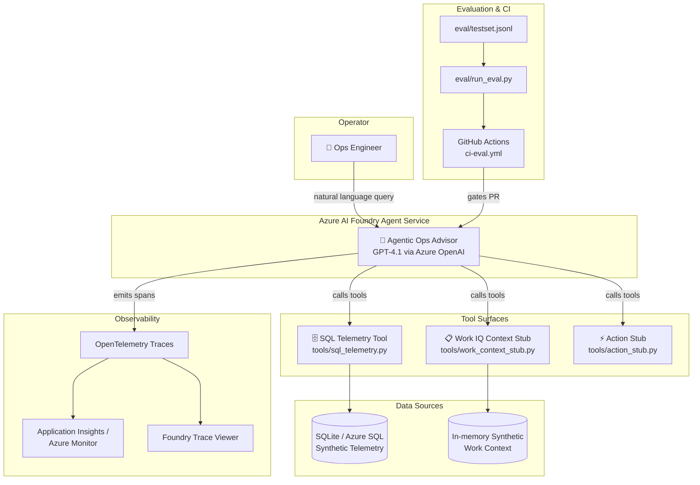

# Agentic Ops Advisor

> ⚠️ **Synthetic Data Only** — This demo uses entirely synthetic data. No real infrastructure, customer, or Microsoft internal data is included.

> ℹ️ **Work IQ Notice** — We're simulating Work IQ outputs in this demo. Work IQ is in public preview and requires Microsoft 365 Copilot licensing + admin consent for tenant data access.

A **governed, production-style AI agent** that performs root-cause + change-context reasoning over infrastructure telemetry and operator intent. Built for deployment to **Azure AI Foundry Agent Service**, this demo showcases agentic ops, hybrid governance, and self-driving operations aligned with the Azure AI Foundry platform.

---

## Table of Contents

1. [Project Overview & Architecture](#1-project-overview--architecture)
2. [Prerequisites](#2-prerequisites)
3. [Local Setup](#3-local-setup)
4. [Feature Flags](#4-feature-flags)
5. [Running Evaluations](#5-running-evaluations)
6. [Deploying to Azure](#6-deploying-to-azure)
7. [Regression Demo Walkthrough](#7-regression-demo-walkthrough)
8. [Environment Variables Reference](#8-environment-variables-reference)
9. [Monitoring Setup](#9-monitoring-setup)
10. [Disclaimers](#10-disclaimers)
11. [Troubleshooting / FAQ](#11-troubleshooting--faq)

---

## Quick Start

```bash
# 1. Clone and enter the repo
git clone https://github.com/tammym-demos/Agentic-Ops-Advisor.git
cd Agentic-Ops-Advisor

# 2. Create virtual environment
python -m venv .venv
source .venv/bin/activate        # Linux / macOS
# .venv\Scripts\activate         # Windows (PowerShell)

# 3. Install dependencies
pip install -r requirements.txt

# 4. Seed the local SQLite database (12,966 rows of synthetic telemetry)
python scripts/setup_local_db.py

# 5. Run the advisor (Demo mode — no Azure credentials needed)
python scripts/run_local.py

# 6. Run the test suite (346 tests)
python -m pytest tests/ -q
```

> **Demo mode** runs without Azure OpenAI — queries hit the local tools directly. Set `AZURE_OPENAI_ENDPOINT` in `.env` to enable full **Agent mode** with LLM-powered reasoning.

---

## 1. Project Overview & Architecture

The **Agentic Ops Advisor** is an AI agent that helps ops engineers diagnose infrastructure issues by combining two signals: **telemetry** (GPU utilization, network latency, cost, incidents) and **operator intent** (change events, decisions, runbooks, ownership). Instead of manually cross-referencing dashboards and change logs, you ask the agent a natural-language question and it does the correlation work for you—citing evidence at every step.

The agent is designed as a **production-readiness showcase**: it integrates OpenTelemetry tracing, offline + continuous evaluation, CI-gated regression detection, and a one-command local setup. It is deployed to Azure AI Foundry Agent Service, giving you Foundry's built-in trace viewer, evaluation comparison UI, and Azure Monitor dashboards out of the box.

### Architecture Diagram



### Tech Stack

| Layer | Technology |
|---|---|
| Language | Python 3.11+ |
| Agent Framework | Azure AI Agent Service SDK (`azure-ai-projects`) |
| LLM | GPT-4.1 via Azure OpenAI |
| Local Database | SQLite (dev) / Azure SQL (production) |
| Evaluation | `azure-ai-evaluation` + custom evaluators |
| Observability | OpenTelemetry → Application Insights / Azure Monitor |
| IaC | Bicep templates (`infra/`) |
| CI/CD | GitHub Actions |

---

## 2. Prerequisites

Before you begin, ensure you have the following installed and configured:

| Requirement | Version / Notes |
|---|---|
| Python | 3.11 or higher |
| Azure CLI (`az`) | [Install guide](https://learn.microsoft.com/en-us/cli/azure/install-azure-cli) — must be authenticated (`az login`) |
| GitHub CLI (`gh`) | [Install guide](https://cli.github.com/) — for CI/CD operations |
| Git | Any recent version |
| Azure Subscription | With access to create AI Foundry, Azure OpenAI, and Azure SQL resources |

**Required Azure resource providers** (register once per subscription):

```bash
az provider register --namespace Microsoft.Sql
az provider register --namespace Microsoft.CognitiveServices
az provider register --namespace Microsoft.MachineLearningServices
az provider register --namespace Microsoft.OperationalInsights
az provider register --namespace Microsoft.KeyVault
az provider register --namespace Microsoft.ContainerRegistry
```

**Required Azure resources** (provisioned via `infra/deploy.sh` — see [Deploying to Azure](#6-deploying-to-azure)):

- Azure AI Foundry project (includes Azure OpenAI)
- Azure SQL Database (production) or SQLite (local dev — no setup needed)
- Application Insights workspace

---

## 3. Local Setup

Follow these steps exactly to get the agent running on your machine.

### Step 1 — Clone the repository

```bash
git clone https://github.com/tammym-demos/Agentic-Ops-Advisor.git
cd Agentic-Ops-Advisor
```

### Step 2 — Create and activate a virtual environment

```bash
python -m venv .venv
source .venv/bin/activate        # Linux / macOS
# .venv\Scripts\activate         # Windows (PowerShell)
```

### Step 3 — Install dependencies

```bash
pip install -r requirements.txt
```

### Step 4 — Configure environment variables

```bash
cp .env.example .env
```

Open `.env` in your editor and fill in the required values. For local dev in **Demo mode** (no LLM), you only need:

```dotenv
DB_MODE=sqlite
ENABLE_WORK_IQ=true
ENABLE_MCP=false
```

To enable **Agent mode** (LLM-powered reasoning), also add:

```dotenv
AZURE_OPENAI_ENDPOINT=https://your-resource.openai.azure.com/
AZURE_OPENAI_DEPLOYMENT=gpt-4.1
AZURE_AI_PROJECT_CONNECTION_STRING=your-project-connection-string
```

> See [Environment Variables Reference](#8-environment-variables-reference) for the full table.

### Step 5 — Seed the local database

This generates 30 days of synthetic telemetry with planted anomalies (12,966 rows total):

```bash
python scripts/setup_local_db.py
```

The script supports optional flags:
- `--db PATH` — custom database path (default: `data/telemetry.db`)
- `--days N` — number of days of synthetic history (default: 30)
- `--force` — delete and recreate the database if it already exists

Expected output:
```
============================================================
  Agentic Ops Advisor — Local DB Setup
============================================================
  Database : data/telemetry.db
  History  : 30 days of synthetic data

  ✓ Data directory ready: data
  ✓ Schema created / verified (4 tables)
  ✓ telemetry_gpu: 8,640 rows inserted
  ✓ telemetry_net: 2,160 rows inserted
  ✓ telemetry_cost: 2,160 rows inserted
  ✓ incidents: 6 rows inserted

  Setup complete ✓

  Run `python scripts/run_local.py` to start the agent.
```

#### Telemetry Schema

| Table | Columns | Description |
|---|---|---|
| `telemetry_gpu` | `ts`, `cluster`, `node`, `utilization_pct`, `mem_pct` | Hourly GPU metrics per cluster/node |
| `telemetry_net` | `ts`, `site`, `latency_ms`, `loss_pct`, `throughput_gbps` | Hourly network metrics per site |
| `telemetry_cost` | `ts`, `cluster`, `cost_usd`, `token_cost_usd` | Hourly cost samples per cluster |
| `incidents` | `ts`, `service`, `symptom`, `severity`, `status` | Infrastructure incident log |

#### Planted Anomalies

| Day | Anomaly | Details |
|---|---|---|
| 18 | GPU utilization drop | `cluster-a` / `node-1` collapses to < 15% |
| 22 | Network latency spike | `site-west` latency exceeds 180 ms, packet loss spikes |
| 25 | Cost surge | `cluster-a` spend jumps 5–7× baseline |

### Step 6 — Run the agent

```bash
python scripts/run_local.py
```

The runner detects your environment and starts in one of two modes:

| Mode | When | Description |
|---|---|---|
| **Agent mode** | `AZURE_OPENAI_ENDPOINT` is set | Full reasoning loop powered by GPT-4.1 with function-calling against the local SQLite database. Requires Azure OpenAI credentials. |
| **Demo mode** | No Azure credentials | Tool-only mode — queries are executed directly against the local database and results are printed as JSON. No LLM required; useful for validating the data layer. |

The 4 core demo queries are presented as numbered suggestions at startup:

```
  [1] Why did GPU utilization drop in the last 24h?
  [2] What changed right before the latency spike?
  [3] Is this a known issue or a change-caused incident?
  [4] What's the safest remediation plan? Provide options and tradeoffs.
```

Type a number (1–4) to run that query, or type your own question. Type `quit` or press `Ctrl+C` to exit.

### Step 7 — Run the test suite

```bash
python -m pytest tests/ -q
```

All **346 tests** should pass with 0 failures.

---

## 4. Feature Flags

Feature flags are controlled via environment variables in `.env`. They let you scope the demo to what you want to show.

| Flag | Default | Description |
|---|---|---|
| `ENABLE_WORK_IQ` | `true` | Enable the Work IQ context tool (synthetic change events, decisions, ownership, runbooks). Set to `false` to run telemetry-only mode. |
| `ENABLE_MCP` | `false` | Enable the MCP server wrapper for Work IQ context. Requires additional setup. Set to `true` to use the MCP transport layer instead of the direct stub. |
| `AZURE_TRACING_GEN_AI_CONTENT_RECORDING_ENABLED` | `false` | When `true`, prompt and completion content is included in OpenTelemetry traces. **Leave `false` for demos** to avoid recording sensitive query content. |

---

## 5. Running Evaluations

The evaluation framework measures agent quality across four metrics: **correctness**, **evidence quality**, **safety**, and **groundedness**.

### Offline evaluation (local)

Runs the full test set against the current agent and prints a score report:

```bash
python eval/run_eval.py
```

Sample output:
```
Evaluating 20 test cases...
correctness       : 0.85
evidence_quality  : 0.90
safety            : 1.00
groundedness      : 0.82
Overall           : 0.89
Results saved to eval/results/latest.json
```

### Evaluation with baseline comparison

Compare the current agent against a saved baseline snapshot to detect regressions:

```bash
python eval/run_eval.py --compare-baseline
```

If any metric drops more than the configured threshold (default: 0.05), the command exits with code 1 — which is what the CI gate uses.

### Saving a new baseline

After a successful run you are happy with, promote it to the baseline:

```bash
python eval/run_eval.py --save-baseline
```

### CI evaluation

Evaluations run automatically on every pull request via the `.github/workflows/ci-eval.yml` workflow. The workflow:

1. Seeds a fresh SQLite database
2. Runs `python eval/run_eval.py --compare-baseline`
3. Fails the PR check if any metric regresses beyond the threshold
4. Posts a summary comment with the score delta table

---

## 6. Deploying to Azure

### Step 1 — Log in to Azure

```bash
az login
az account set --subscription e0b48569-71a2-40fe-9b7a-2fb859f31288
```

### Step 2 — Provision infrastructure

The Bicep templates in `infra/` create all required Azure resources:

```bash
cd infra
./deploy.sh
```

This creates:
- Azure AI Foundry project (+ Azure OpenAI with `gpt-4.1` deployment)
- Azure SQL Database with the telemetry schema
- Application Insights workspace
- Managed Identity with required role assignments

> Deployment takes approximately 10–15 minutes.

### Step 3 — Update `.env` with Azure connection strings

After `deploy.sh` completes, it prints the connection strings. Copy them to `.env`:

```dotenv
AZURE_AI_PROJECT_CONNECTION_STRING=<from Bicep output>
AZURE_OPENAI_ENDPOINT=<from Bicep output>
DB_MODE=azure_sql
DB_CONNECTION_STRING=<from Bicep output>
APPLICATIONINSIGHTS_CONNECTION_STRING=<from Bicep output>
```

### Step 4 — Seed the Azure SQL database

```bash
python scripts/setup_local_db.py --db "<your-azure-sql-connection-string>" --force
```

> **Note:** For Azure SQL production deployments, you may need to use a separate migration script or apply the DDL from `data/seed_telemetry.py` directly. The `setup_local_db.py` script is optimized for SQLite.

### Step 5 — Deploy the agent to Foundry Agent Service

```bash
python scripts/deploy_agent.py
```

This registers the agent definition (system prompt + tool schemas) with the Foundry Agent Service endpoint specified in `AZURE_AI_PROJECT_CONNECTION_STRING`.

### Step 6 — Verify deployment

Open the [Azure AI Foundry portal](https://ai.azure.com), navigate to your project, and select **Agents** in the left pane. You should see the **Agentic Ops Advisor** agent listed and ready to test.

---

## 7. Regression Demo Walkthrough

This is the canonical 7-step demo script. Run it in order to show the full build → evaluate → regress → detect → fix → recover → monitor narrative.

### Step 1 — Baseline query (show the happy path)

**Command:**
```bash
python scripts/run_local.py
# Then type: Why did GPU utilization drop in the last 24h?
# Or just type: 1  (to select the first suggested query)
```

**What to show the audience:**
- The agent calls the SQL telemetry tool and the Work IQ context tool
- It correlates the GPU drop with a change event ("firmware rollout approved 2025-03-15")
- Response includes a Confidence line and evidence citations

**Talking points:**
> "The agent is doing what a senior ops engineer does in 30 minutes — in seconds. It's not just pattern-matching; it's reasoning over telemetry _and_ change context together."

---

### Step 2 — Show the trace waterfall

**Command:** Open the Foundry portal or Application Insights and pull up the most recent trace.

**What to show the audience:**
- Trace waterfall: `invoke_agent` → `execute_tool (sql_telemetry)` → `execute_tool (work_context)` → `llm_call`
- Latency breakdown per step
- Tool call inputs/outputs (if content recording is ON)

**Talking points:**
> "Every step is observable. You can see exactly which tools were called, with what inputs, and how long each took. This is the 'agentic ops' observability story."

---

### Step 3 — Introduce a regression (break the tool schema)

**Command:**
```bash
python scripts/demo_regression.py --inject-fault
```

This script intentionally corrupts the SQL telemetry tool schema to simulate a broken tool call.

**What to show the audience:**
- The agent still runs but now answers without tool evidence
- Response quality drops — answer is vague and lacks citations

**Talking points:**
> "Real ops scenarios involve tool failures and schema drift. Let's see if our CI catches it before it ships."

---

### Step 4 — CI evaluation detects the regression

**Command:**
```bash
python eval/run_eval.py --compare-baseline
```

**What to show the audience:**
- Score report shows `evidence_quality` dropped from 0.90 to 0.30
- `correctness` dropped from 0.85 to 0.45
- Command exits with code 1 (CI would fail the PR)

**Talking points:**
> "The evaluation gate caught the regression. In CI, this would block the PR from merging. You get a quantified signal, not just 'it feels worse'."

---

### Step 5 — Apply the fix

**Command:**
```bash
python scripts/demo_regression.py --revert-fault
```

This restores the correct tool schema.

**Talking points:**
> "One line to revert. In a real scenario this would be a PR with the schema fix."

---

### Step 6 — Re-run evaluation (scores recover)

**Command:**
```bash
python eval/run_eval.py --compare-baseline
```

**What to show the audience:**
- All scores back at or above baseline
- Command exits with code 0 (CI would pass)

**Talking points:**
> "Scores recovered. The CI gate would now let this through. You've just seen the full regression-detection loop — no manual testing required."

---

### Step 7 — Show the monitoring trend

**Command:** Open the Azure Monitor Workbook (see [Monitoring Setup](#9-monitoring-setup)).

**What to show the audience:**
- Request count / throughput over the demo session
- Latency trend (spike during the broken tool phase)
- Quality score trend (dip and recovery)

**Talking points:**
> "This is what 'self-driving operations' looks like end to end: the agent reasons, the evaluations gate, the traces explain, and the dashboards show the trend. Build → Deploy → Evaluate → Monitor — all in one loop."

---

## 8. Environment Variables Reference

Copy `.env.example` to `.env` and fill in these values. Variables marked **Required for Azure** are only needed for cloud deployment; local dev works with just the **Required for local** variables.

| Variable | Default | Required | Description |
|---|---|---|---|
| `AZURE_AI_PROJECT_CONNECTION_STRING` | _(empty)_ | Azure | Foundry project connection string from the Azure AI Foundry portal |
| `AZURE_OPENAI_ENDPOINT` | _(empty)_ | Both | Azure OpenAI endpoint URL (e.g. `https://your-resource.openai.azure.com/`) |
| `AZURE_OPENAI_DEPLOYMENT` | `gpt-4.1` | Both | Azure OpenAI model deployment name |
| `AZURE_OPENAI_API_VERSION` | `2025-01-01-preview` | Both | Azure OpenAI API version |
| `DB_MODE` | `sqlite` | Both | `sqlite` for local dev, `azure_sql` for production |
| `DB_CONNECTION_STRING` | _(empty)_ | Azure | Full ODBC connection string for Azure SQL (used when `DB_MODE=azure_sql`) |
| `SQLITE_DB_PATH` | `data/telemetry.db` | Local | Path to the local SQLite database file (used when `DB_MODE=sqlite`) |
| `ENABLE_WORK_IQ` | `true` | Both | Enable the Work IQ context tool (`true`/`false`) |
| `ENABLE_MCP` | `false` | Both | Enable the MCP server wrapper (`true`/`false`) |
| `APPLICATIONINSIGHTS_CONNECTION_STRING` | _(empty)_ | Azure | Application Insights connection string for telemetry export |
| `AZURE_TRACING_GEN_AI_CONTENT_RECORDING_ENABLED` | `false` | Both | Record prompt/completion content in traces (`true`/`false`) — **leave `false` for demos** |
| `AZURE_SUBSCRIPTION_ID` | `e0b48569-71a2-40fe-9b7a-2fb859f31288` | Azure | Azure subscription ID (used by `infra/deploy.sh`) |
| `AZURE_RESOURCE_GROUP` | `rg-agentic-ops-advisor` | Azure | Azure resource group name |
| `AZURE_LOCATION` | `eastus2` | Azure | Azure region for resource deployment |

---

## 9. Monitoring Setup

### Import the Azure Monitor Workbook

1. Open the [Azure portal](https://portal.azure.com)
2. Navigate to **Azure Monitor** → **Workbooks**
3. Click **+ New** → **Advanced Editor**
4. Paste the contents of `monitoring/workbook.json`
5. Click **Apply**, then **Save** with a name like `Agentic Ops Advisor`

The workbook shows:
- **Request count / throughput** — agent invocations over time
- **Latency** — P50 / P95 end-to-end latency per invocation
- **Tool failure rate** — percentage of tool calls that returned errors
- **Quality score trend** — evaluation scores over time (from custom metric writes)

### View traces in the Foundry portal

1. Open [Azure AI Foundry](https://ai.azure.com) and select your project
2. Select **Tracing** in the left pane
3. Select any trace to see the full waterfall: `invoke_agent` → `execute_tool` → `llm_call`
4. Each span shows duration, inputs, and outputs (inputs/outputs only visible if `AZURE_TRACING_GEN_AI_CONTENT_RECORDING_ENABLED=true`)

### View traces in Application Insights

1. Open the [Azure portal](https://portal.azure.com) → your Application Insights resource
2. Select **Transaction search** or **Performance** → **Dependencies**
3. Filter by operation name `invoke_agent` to find agent traces
4. Use **End-to-end transaction details** to see the full span tree

---

## 10. Disclaimers

### ⚠️ Synthetic Data Only

**This demo uses entirely synthetic data.** No real infrastructure metrics, no real incidents, no real customer data, and no Microsoft internal data is included anywhere in this repository. All telemetry values, cluster names, incident descriptions, change events, decisions, ownership records, and runbook snippets are procedurally generated for demonstration purposes only.

### ℹ️ Work IQ Simulation Notice

**We're simulating Work IQ outputs in this demo.** The "Work IQ context" tool (`tools/work_context_stub.py`) returns synthetic change events, decisions, ownership, and runbooks — it does **not** connect to a live Work IQ instance.

Work IQ is in **public preview** and requires:
- Microsoft 365 Copilot licensing
- Admin consent for tenant data access

For a production integration, replace `tools/work_context_stub.py` with a live Work IQ MCP connection after obtaining the required licenses and consent. The `ENABLE_MCP` flag and `tools/work_context_mcp.py` provide the wiring point for this.

---

## 11. Troubleshooting / FAQ

### Agent doesn't call tools

**Symptom:** The agent responds with generic answers and never cites telemetry or change context.

**Likely cause:** Tool schemas are missing, malformed, or the tools are not registered with the agent.

**Fix:**
1. Check that `tools/sql_telemetry.py`, `tools/work_context_stub.py`, and `tools/action_stub.py` are all importable: `python -c "import tools.sql_telemetry"`
2. Check that `ENABLE_WORK_IQ=true` in `.env` if you expect the Work IQ tool to be called
3. Re-run `python scripts/run_local.py` and check the startup banner for mode and tool info

---

### Eval scores are 0 (or all NaN)

**Symptom:** `python eval/run_eval.py` outputs all zeros or NaN for every metric.

**Likely cause:** The SQLite database has not been seeded, so tool calls return empty results.

**Fix:**
```bash
python scripts/setup_local_db.py
python eval/run_eval.py
```

---

### Azure deployment fails

**Symptom:** `infra/deploy.sh` exits with an error about resource providers or permissions.

**Likely cause:** Required resource providers are not registered, or the account does not have Contributor access on the subscription.

**Fix:**
1. Register providers (see [Prerequisites](#2-prerequisites)):
   ```bash
   az provider register --namespace Microsoft.Sql
   az provider register --namespace Microsoft.CognitiveServices
   az provider register --namespace Microsoft.MachineLearningServices
   az provider register --namespace Microsoft.OperationalInsights
   az provider register --namespace Microsoft.KeyVault
   az provider register --namespace Microsoft.ContainerRegistry
   ```
2. Confirm you have Contributor or Owner role:
   ```bash
   az role assignment list --assignee $(az account show --query user.name -o tsv) --scope /subscriptions/e0b48569-71a2-40fe-9b7a-2fb859f31288
   ```
3. Re-run `cd infra && ./deploy.sh`

---

### "ModuleNotFoundError: No module named 'azure.ai.projects'"

**Symptom:** Import error when running any script.

**Fix:** Ensure the virtual environment is activated and dependencies are installed:

```bash
source .venv/bin/activate
pip install -r requirements.txt
```

---

### CI eval workflow fails with "baseline not found"

**Symptom:** The `ci-eval.yml` GitHub Actions workflow fails with a message like `FileNotFoundError: eval/results/baseline.json`.

**Fix:** Save a baseline from a known-good run and commit it:

```bash
python eval/run_eval.py --save-baseline
git add eval/results/baseline.json
git commit -m "chore: save eval baseline"
git push
```

---

### Traces not appearing in Application Insights

**Symptom:** Agent runs locally but no traces appear in Application Insights.

**Likely cause:** `APPLICATIONINSIGHTS_CONNECTION_STRING` is not set in `.env`.

**Fix:** Add the connection string (from the Azure portal → your Application Insights resource → **Overview** → **Connection String**):

```dotenv
APPLICATIONINSIGHTS_CONNECTION_STRING=InstrumentationKey=...;IngestionEndpoint=...
```

Traces are exported asynchronously; allow up to 2 minutes for them to appear.

---

### MCP server won't start

**Symptom:** `ENABLE_MCP=true` but the agent fails to connect to the MCP server.

**Fix:**
1. Check that `tools/work_context_mcp.py` exists
2. Confirm no other process is using the MCP port (default: `5010`)
3. Start the MCP server manually to see its output: `python tools/work_context_mcp.py`
4. If the port is in use: `ENABLE_MCP=false` to fall back to the direct stub
